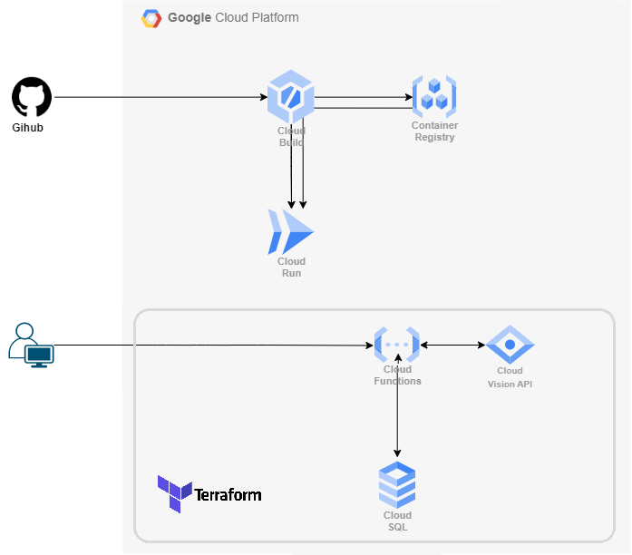
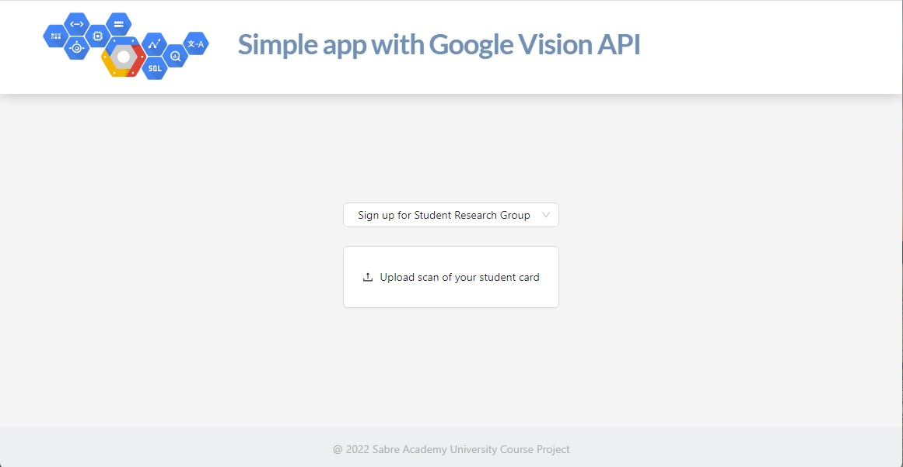

# GCP university course project

The purpose of this project is to show concept of how to use and integrate collaboration of couple Google Cloud Platform services with simple React application.

## Architecture diagram

---



## React app

---

Simple web application was created in React framework. It's main functionality is to give students interface to signup or resign from membership in some student research group. To do that user need only his/her student identification card. This is only proof of concept so user uploading scan/image of his/her student identification card. By submitting upload of image client send request on prepared Cloud Function in which image is analyse with use of Vision API to detect text - to detect student identification number. Than data is saved to Cloud SQL PostgreSQL database. And finaly response is send from Clound Function back to client.

## Application deployment

---



Application is build, deployed and run with use os Cloud Build, Container Registery and Cloud Run GCP services with were integrated with GitHub Action so with every commit new build and deployment of new application image is triggered. GitHum Action uses .github/workflows/gcr-deploy.yml script to do all the flow.

## GCP backend

---

On server side below services are used:

- Cloud Function (with Cloud Storage for uploaded CF code)
- Cloud Vision API
- Cloud SQL

## Automation

---

Client application build and deployment is automate by Github Action and used GCP services. On the other hand server side uses Terraform which main creates required for app database and deploy prepared Cloud Function.

## Instruction

---

To initialize Terraform run:

```
terraform init
```

To prepare execution plan run:

```
terraform plan
```

To prepare executes actions proposed in a Terraform plan to create or update infrastructure run:

```
terraform apply
```

To destroy all remote objects managed by prepared Terraform configuration run:

```
terraform destroy
```
